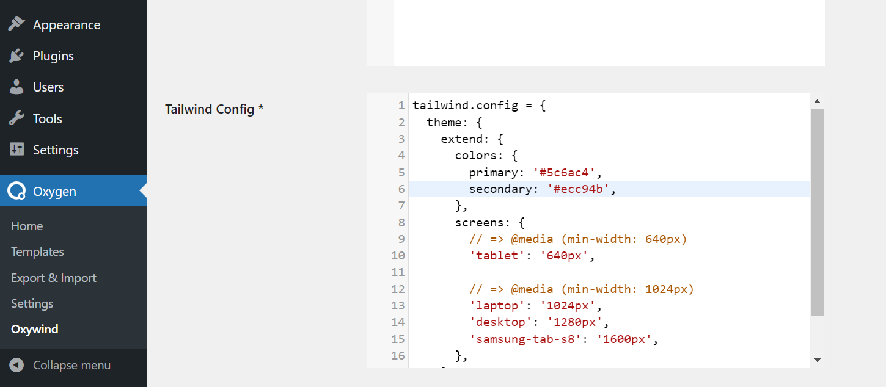
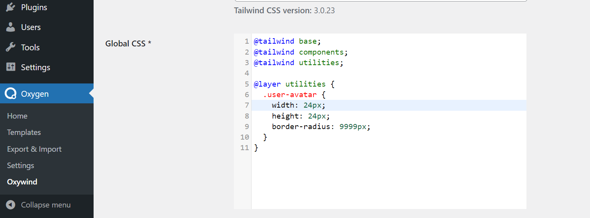

# Customization

Tailwind has been designed from the ground up to be extensible and customizable, so that no matter what you’re building you never feel like you’re fighting the framework.

Because Tailwind is a framework for building bespoke user interfaces, it has been designed from the ground up with customization in mind.

## Customizing your theme

Every section of the config is optional, so you only have to specify what you’d like to change. Any missing sections will fall back to Tailwind’s [default configuration](https://github.com/tailwindlabs/tailwindcss/blob/master/stubs/defaultConfig.stub.js).

If you want to change things like your color palette, spacing scale, typography scale, or breakpoints, add your customizations to the "Tailwind Config" field on **Oxygen Builder > Oxywind** menu and under the **Settings** tab.

You can refer the [Tailwind CSS documentation](https://tailwindcss.com/docs/configuration#theme) for more details.

## Functions & Directives

Directives are custom Tailwind-specific at-rules you can use in your CSS that offer special functionality for Tailwind CSS projects.

Use the `@tailwind` directive to insert Tailwind’s `base`, `components`, `utilities` and `variants` styles into your CSS.

If you want to customize your main css file, add your customizations to the "Global CSS" field on **Oxygen Builder > Oxywind** menu and under the **Settings** tab.

You can refer the [Tailwind CSS documentation](https://tailwindcss.com/docs/functions-and-directives) for more details.

