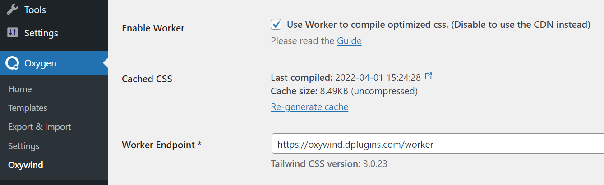

# Production

While the CDN is enough to run the Tailwind CSS and generate the styles right on your browser, however it may not ideal for the production site.

The JIT engine CDN size is ~355kB (no compression) and it is too heavy to be loaded for every request.

When you have completed your design or made some changes, you may want to generate the CSS file and cache it on your server. The generated CSS file will be a single CSS file for the entire website with less than 10kb. The generation or compilation task is handled by our worker who runs on our server.

To generate the CSS cache file, navigate to on **Oxygen Builder > Oxywind** menu and under the **Settings** tab.
Tick the "Enable Worker" field and save. Once saved, click the "Generate cache" or "Re-generate cache" link on the "Cached CSS" field.

