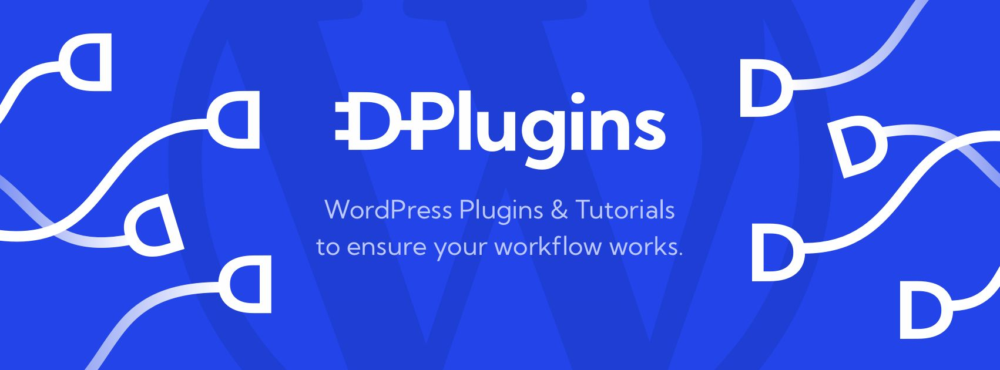
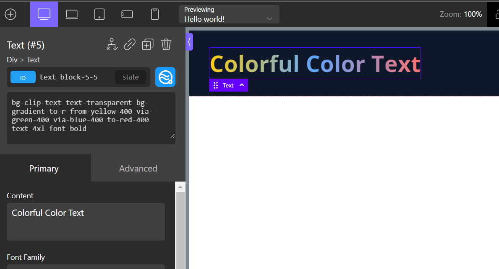

# Introduction

:::info Oxywind only support Oxygen Builder 4!

- There will be no support for Oxygen Builder 3.
- Oxywind has planned to be ported to other WordPress website builders such as Bricks Builder, Elementor, and Gutenberg.
  :::

  <a href="https://youtube.com/playlist?list=PLaN3YIeFObKluQ2YSaiFFSG56aIlweZLF" target="_blank">
    

      
    

    
Learn Tailwind CSS and Oxywind with video tutorials on DPlugins YouTube channel

    

        
    

  </a>

## What is Oxywind?

Tailwind CSS is a utility-first CSS framework packed with classes like `flex`, `pt-4`, `text-center`, and `rotate-90` that can be composed to build any design, directly in your HTML.

Oxywind is a WordPress plugin that allows you to use Tailwind CSS within Oxygen Builder.
With Oxywind activated, you will have an extra input field inside the Oxygen Builder's editor to input multiple classes at once. In this way, you will be able to style the element faster with fewer clicks.

Here is a simple example:

The above example demonstrates the two benefits of Oxywind:

- **Multipe Classes Name**: Oxywind make it possible to write multiple classes name at once without clicking around the editor interface. Rapidly design your page and 2.5x more productive.

- **No Restriction on Classes Name**: Oxywind allow you to use classes name with several character that supported by Tailwind CSS such as `hover:text-red-800`, `p-[117px]`, `basis-1/4`, `bg-[#bada55]`, `before:content-['Festivus']`.

You may already have questions - don't worry. We will cover every little detail in the rest of the documentation. For now, please read along so you can have a high-level understanding of what Oxywind offers.

:::tip Prerequisites
The rest of the documentation assumes basic familiarity with Tailwind CSS. If you are totally new to Tailwind CSS, it might not be the best idea to jump right into the Oxywind as your first step - grasp the basics then come back!
:::

## Deep Integration of Tailwind CSS

Oxywind is a WordPress plugin that brings you the power of Tailwind CSS right on your WordPress hosted on any kind of server even shared-hosting. We have researched the best way to integrate Tailwind CSS with Oxygen Builder and have implemented it in the most efficient way.

## CDN

Prior to Tailwind CSS v3.0 (v2.0 or earlier), the CDN provided is a giant CSS file that contains pre-generated CSS classes for every default class that is available in the Tailwind CSS. This results in a huge amount of CSS classes that will be loaded on your browser.

Tailwind CSS v3.0 is powered by the Just-in-Time (JIT) engine. The JIT engine generates styles you need for your design on-demand and it can be run right in the browser using the [CDN](https://tailwindcss.com/docs/installation/play-cdn) without any build step.

Oxywind loads the Tailwind CSS CDN into the Oxygen Builder editor and generates the style you need on-the-fly. The generation is instant and you can see the results right away before you even have to blink.

## Worker

While the CDN is enough to run the Tailwind CSS and generate the styles right on your browser, however it may not ideal for the production site.

The JIT engine CDN size is ~355kB (no compression) and it is too heavy to be loaded for every request.

Since the CDN is a javascript code and generates the style on the fly, there will be a "blip" or flash on your page on the initial of the request as the result of waiting for the style generated completely. This may affect the performance and the Lighthouse score of your website.

To address this issue, we have provided a feature on Oxywind for you to generate and cache the CSS file instead of loading the CDN on the front page.

This task is handled by our worker who runs on our server. In this way, we are removing the need for the server to generate the CSS file.
Our worker is open-sourced and available on [GitHub](https://github.com/dplugins/oxywind-worker).

## Still Got Questions?

Check out our [FAQ](/about/faq).

## Next Steps

On you have read through the [Introduction](/guide/introduction#what-is-oxywind), you may want to start using Oxywind right away.

  <a class="vt-box" href="https://dplugins.com/oxywind">
    
Download the plugin

    
Download the Oxywind plugin and start designing your website.

  </a>
  <a class="vt-box" href="/guide/quick-start.html">
    
Read the Installation Guide

    
The guide walks you through on how to install the Oxywind plugin.

  </a>
  <a class="vt-box" href="https://www.youtube.com/playlist?list=PLaN3YIeFObKluQ2YSaiFFSG56aIlweZLF">
    
Watch the Tutorial Videos

    
Learn by watching the tutorials videos.

  </a>

