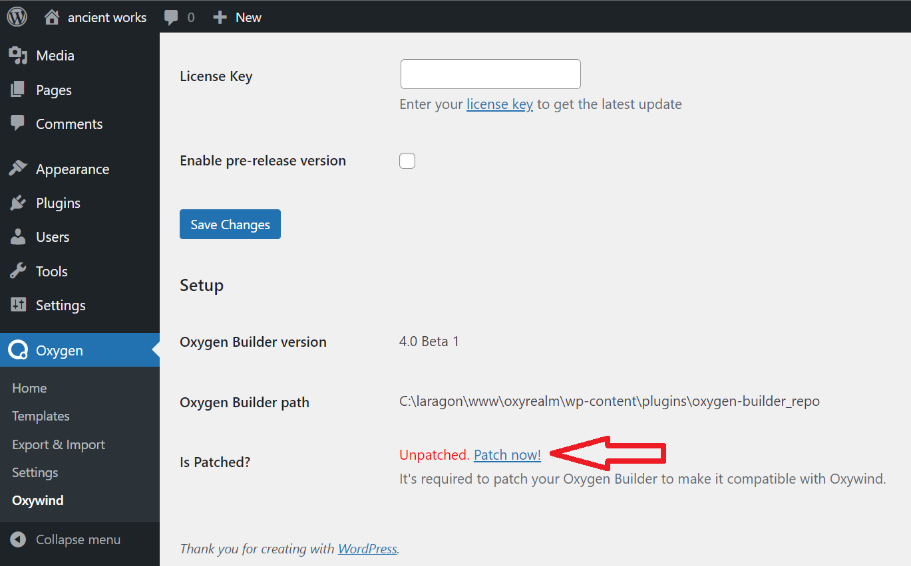
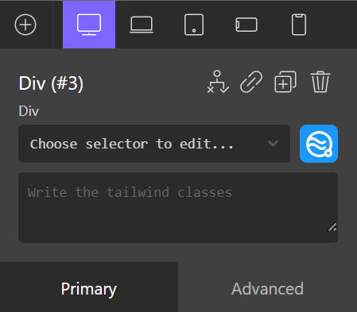

# Quick Start

Installing and running the Oxywind plugin is easy and straightforward.
This guide walks you through on how to setup the Oxywind plugin, made as simple as possible for you to follow.

## Server Requirements

Oxywind has a few system requirements. Of course, modern hosting satisfies all of these requirements, so it's highly recommended that you use modern hosting to run the Oxywind.

You will need to make sure your server meets the following requirements:

- PHP 7.4+
- WordPress 5.5+

:::tip Recommendations

The following server requirements are required to make Oxywind's patcher feature work seamlessly:

- Git 2.1.0+
- PHP `exec` function enabled
  :::

## Installation

Log in and download the latest Oxywind plugin from the [Download Page](https://dplugins.com/checkout/downloads/).

If you have a copy of the plugin as a zip file, you can manually upload it and install it through the WordPress admin screen.

1. Navigate to **Plugins > Add New**.
2. Click the **Upload Plugin** button at the top of the screen.
3. Select the zip file from your local filesystem.
4. Click the **Install Now** button.
5. When the installation is complete, you’ll see “Plugin installed successfully.” Click the **Activate Plugin** button at the bottom of the page.

If you have any issues or confusion about how on installing a plugin, WordPress has a comprehensive [guide on how to install a plugin](https://wordpress.org/support/article/managing-plugins/#manual-upload-via-wordpress-admin) that will help you out.

## Patching Oxygen Builder

To make Oxywind successfully integrate the Tailwind CSS into the Oxygen Builder, Oxywind need to patch the Oxygen Builder to pass over the limitation of the Oxygen Builder that is not possible by only extending it.

There are several ways to patch the Oxygen Builder, either by using Oxywind's patcher feature or manually replacing the Oxygen Builder's original file with patched applied files.

### Oxywind's Patcher Feature

Oxywind has a patcher feature that allows you to patch the Oxygen Builder. The feature is accessible from the Oxygen Builder's **Oxygen Builder > Oxywind** menu and under the **License** tab.

On the **Setup** section, Click the "Patch now!" link.

If your server doesn't have the PHP `exec` function enabled or you don't have Git installed, the "Patch now!" link will be disabled or hidden. You can still manually patch the Oxygen Builder by following the [Manual Patching](#manual-patching) section below.

### Manual Patching

If the Oxywind's patched feature failed to patch the Oxygen Builder, you can manually patch the Oxygen Builder by following this guide.

Download the latest Oxygen Builder plugin zip file from the [Oxygen Builder website](https://oxygenbuilder.com/portal/).

Download one of the following patched files:
- [Oxygen Builder 4.0 Beta 1](https://dplugins.com/wp-content/uploads/2022/04/4.0-beta.1.zip)
- [Oxygen Builder 4.0 Beta 2](https://dplugins.com/wp-content/uploads/2022/04/4.0-beta.2.zip)

Extract the downloaded Oxygen Builder plugin zip file and use the downloaded patched files to replace the original files in the Oxygen Builder plugin folder.

Compress back the Oxygen Builder plugin folder into a zip file and upload it to the WordPress admin screen.

You may be prompted to replace the existing installed Oxygen Builder plugin with the new one and accept the prompt.

## Using Tailwind CSS

If you have successfully patch the Oxygen Builder, you can now use the Tailwind CSS to style the element inside the Oxygen Builder editor.

